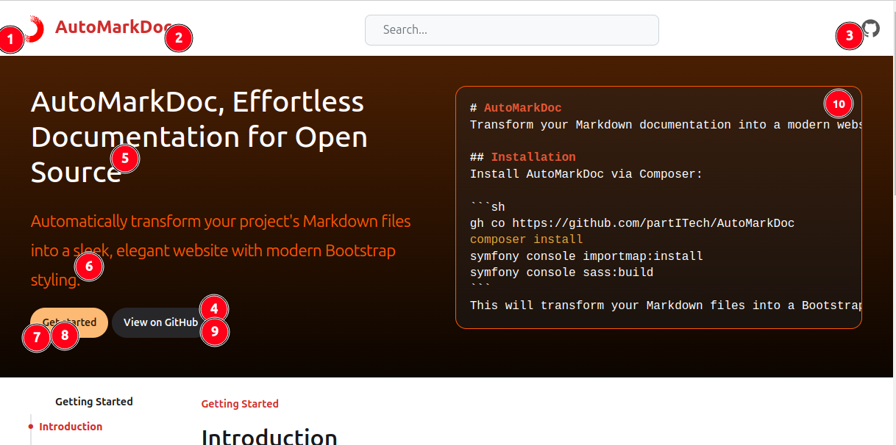

# Quick Start

> [!NOTE]
> Please ensure you have installed the project before proceeding with the main configuration.

## Concept

AutoMarkDoc strives to remain as straightforward as possible, offering a simple alternative for projects that already maintain documentation in Markdown. While the setup process is minimal, there are still a few essential steps:
- Create a `menu.md` file that defines your left-hand navigation menu.
- Provide a configuration file, which includes key variables such as your project name and repository URL.

## Menu

You will need to create a `menu.md` file within the directory designated to hold your documentation. Below is an example:

> [!IMPORTANT]
> Make sure to separate each menu section with a `---` delimiter.  
> This allows the system to easily distinguish different menu blocks.

```markdown
## Getting Started
- [Introduction](introduction.md)
- [Installation](installation.md)
- [Quick Start](quick_start.md)

---

## Usage
- [Graphical Examples](markdown_examples.md)

---

## Extras
- [Contributing](contributing.md)
- [References & Resources](references.md)

---
```


## Configurations

Vous devez également créer un fichier `config.yaml` avec l'ensemble des informations permettant de customiser l'ensemble de ***AutoMarkDoc***

```yaml
projectName: "AutoMarkDoc"
defaultDoc: "introduction.md"
logoHref: "https://my-website.com/"
logoUrl: "/images/logo.svg"
projectSource: "https://github.com/partITech/AutoMarkDoc"
jumbotronSourceLinkCodeLink: "https://github.com/partITech/AutoMarkDoc"
enableSearch: true
jumbotron: true
jumbotronHeader: "AutoMarkDoc, Effortless Documentation for Open Source"
jumbotronTextLine: "Automatically transform your project's Markdown files into a sleek, elegant website with modern Bootstrap styling."
jumbotronGetStartedLabel: "Get started"
jumbotronGetStartedLink: "#main-content"
jumbotronSourceLinkCodeLabel: "View on GitHub"
jumbotronCodeLang: "markdown"
jumbotronCodeContent: |
  # AutoMarkDoc
  Transform your Markdown documentation into a modern website effortlessly.

  ## Installation
  Install AutoMarkDoc via Composer:

  ```sh
  gh co https://github.com/partITech/AutoMarkDoc
  composer install
  symfony console importmap:install
  symfony console sass:build
  
  This will transform your Markdown files into a Bootstrap-powered website.
```
)
### Parameters

1. **`logoUrl`**: Path to your project's logo. It is recommended to store it in `public/images/`.
2. **`projectName`**: The name of your documentation project.
3. **`projectSource`**: URL linking to your project's GitHub repository.
4. **`jumbotronSourceLinkCodeLink`**: URL for the second button in the jumbotron section.
5. **`jumbotronHeader`**: Primary headline for the jumbotron.
6. **`jumbotronTextLine`**: Additional tagline for the jumbotron.
7. **`jumbotronGetStartedLabel`**: Label text for the first button in the jumbotron.
8. **`jumbotronGetStartedLink`**: URL for the first button in the jumbotron.
9. **`jumbotronSourceLinkCodeLabel`**: Label text for the second button in the jumbotron.
10. **`jumbotronCodeContent`**: Predefined code snippet displayed within the jumbotron.


### Additional settings
- **`defaultDoc`**: Specifies the main documentation page to display by default.
- **`enableSearch`**: Enables a search feature (currently disabled by default, planned for future implementation).
- **`jumbotron`**: Defines whether the jumbotron should be displayed on the default page.
- **`logoHref`**: logo href if not set wil use the current project's doc url.
